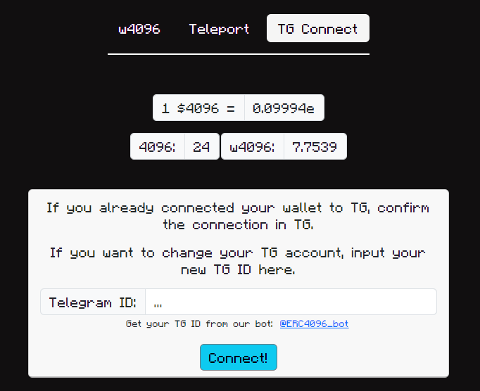

# Telegram connection

You need to connect your ETH wallet(s) to your Telegram account to be a member of the Club. You can connect multiple wallets to one TG account.

To start, message 4096 bot: [https://t.me/4096ERC\_bot](https://t.me/ERC4096\_bot) and type `/connect`\
The bot will give you a link to the 4096 App that will take you to the "TG connect" tab:

<figure><figcaption></figcaption></figure>

You would need to sign a message to confirm the ownership of the wallet. After signing, go back to Telegram and type `/confirm 0xYourAddress` to finalize the connection.


You need your TG ID, not your TG username in order to make a connection. Once you message /connect to the 4096 bot, it will give you a link so the ID will already be pasted in the App once you follow it.



**When signing any messages with your wallet, make sure you understand the contents of the message. In this case, it will be a text in the format **_**your TG ID**_** -> **_**your address**_

